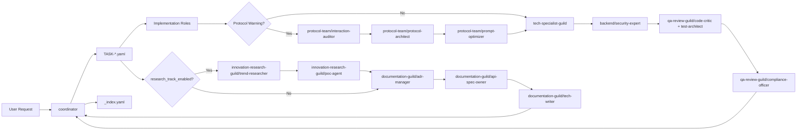

# Architecture Guide

## Purpose
AgentTeams v2.3 の実装・通信・品質・研究・バックエンドセキュリティ連携フローを示す。

## Multi-Guild Flow (Mermaid)

## State Topology
- 全体俯瞰: `.codex/states/_index.yaml`
- task 詳細: `.codex/states/TASK-*.yaml`
- 警告証跡: `warnings[]`
- 技術ルーティング: `target_stack.*`
- バックエンドセキュリティゲート: `local_flags.backend_security_required`

## Notes
- API 契約の正本は `docs/api/openapi.yaml`
- 通信規約の正本は `docs/guides/communication-protocol.md`
- `qa_review_required=true` の task は QA 完了前に `done` 不可
- `backend_security_required=true` の task は `backend/security-expert` 完了前に `done` 不可
- バックエンド実装は `Security先行 -> QA` を基本順序とする
- `research_track_enabled=true` の採用判断は `poc_result + ADR承認` が必須
